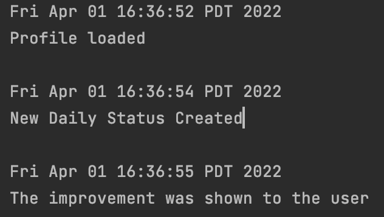
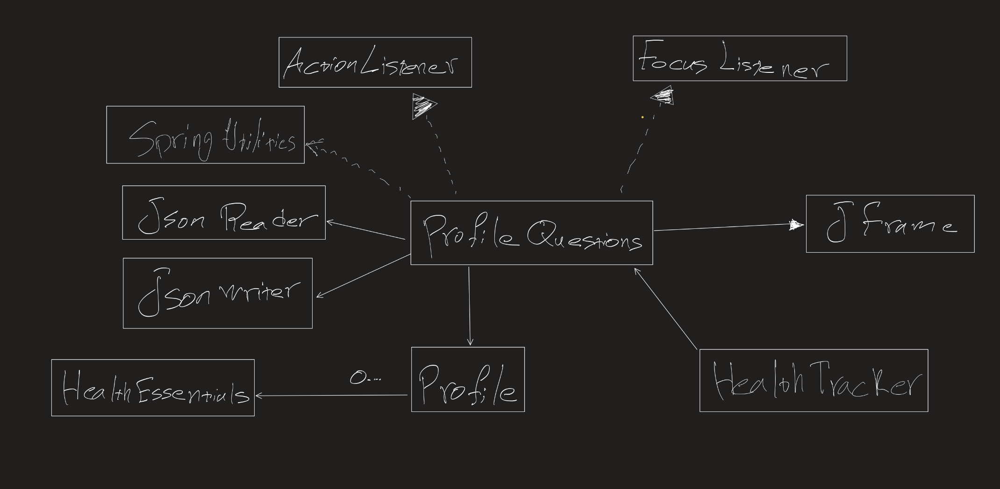

# The health tracker
## Know how our life-style could affect our health.
Save your money and time by letting the app know what your mental/physical
status is so it could create a new life-style for you to improve it.

#

By spending less than a minute a day on health tracker you can:
- ### Be aware of your general health condition and take control of your physical and mental status.       

  By the information that the user provide, the app can let the user know whenever 
his/her general health condition is in danger (for example his/her weight/height
ratio or the blood pressure). 
It can also give the user some tips about healthy life-style.

- ### Get suggestion on what to eat and also their recipes.

   After getting the users' food preferences, the health tracker will provide easy
food recipes which will match the users interest.

- ### Set goals on how you expect your body to perform.

   The user can set future goals so that the whole program's behaviour will be based 
on those goals.

This app is made for people who care what they put in their body and believe that their 
food habits and their actions could actually have big impacts on their daily mood and 
their future.

# Phase 1
## As a user:

   - I want to create a personal profile.
   - I want to create a health profile and test how healthy I am.
   - I want to get my first prescription and know what is my mental/physical status and 
  a few tips on how to improve it.

# Phase 2
## As a user:

- I want my profile to be saved automatically.
- I want to load my profile the next day.
- I want to mention that I followed up the given diet or not.
- I want to possibly get a new diet.

# Phase 4
## Task 2:
Eventlog

# Phase 4
## Task 3:
Hierarchy

#

#
